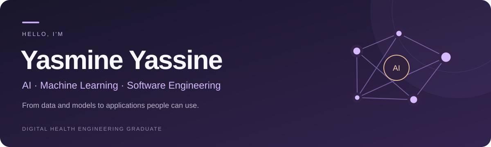

  

  

  <a href="https://yasmine712.github.io/YASMINE712/"><strong>Explore my interactive portfolio ↗</strong></a> ·
  <a href="https://www.linkedin.com/in/yasmine-yassine-21ab61285/">LinkedIn</a> ·
  <a href="https://github.com/YASMINE712?tab=repositories">Explore my repositories</a> ·
  <a href="https://github.com/YASMINE712/HAYAT-CARE">Featured: HayatCare</a>

### A little about me

I'm **Yasmine**, a Digital Health Engineering graduate from **Mohammed VI University of Sciences and Health**. I work across AI, data, and software development, from preparing datasets and evaluating models to building interactive applications.

I'm particularly interested in **computer vision, language models, and practical ML applications**. I enjoy understanding a user's needs, learning the tools a project requires, and turning an idea into working software.

<a href="#selected-projects">Projects</a> · <a href="#my-toolkit">Skills</a> · <a href="#experience">Experience</a> · <a href="#beyond-the-code">Beyond the code</a>

### Selected projects

| Project | What I worked on |
| :--- | :--- |
| **[HayatCare](https://github.com/YASMINE712/HAYAT-CARE)** | An elderly-care application combining adaptive cognitive activities, personal ML progress analysis, medication schedules, phone motion monitoring, and YOLO object detection. |
| **[ProCardio](https://github.com/YASMINE712/procardio-showcase)** | A SaaS platform combining interactive interfaces, workflow automation, and a deep-learning module for image analysis. |
| **ClinicalBERT robustness** | Evaluation of BioClinicalBERT under adversarial and backdoor attacks, with defense methods. |
| **OncoSense** | A computer-vision application for image analysis and classification using deep learning. |

Other projects include **My Health Friend**, a personalized ML recommendation system, and **Smart Maternity Care**, predictive modeling with clinical data.

### My toolkit

<strong>Explore the tools I work with</strong>

**AI & machine learning**  
Python · PyTorch · TensorFlow / Keras · scikit-learn · Hugging Face · OpenCV  
Computer vision · CNNs · Transformers · NLP · LLMs · Model evaluation

**Software development**  
JavaScript / TypeScript · React · Django · Node.js · Streamlit · SQL · C/C++ · APIs

**Data & tools**  
pandas · NumPy · ETL · Spark · Kafka · Airflow · Power BI · AWS · Docker · Git · Linux

### Experience

<strong>Explore my internships and experience</strong>

- **Ciprotec · Final-year engineering internship · Feb–Jul 2026**  
  Software development, workflow automation, and computer vision for ProCardio.
- **Cheikh Khalifa International University Hospital · Jul–Aug 2025**  
  Deep-learning image classification, from data preparation and training to evaluation and integration.
- **UM6SS Biomedical Experimentation Center · Jul 2024**  
  Technical observation internship in imaging workflows, 3D modeling, and digital prototyping.

### Beyond the code

I enjoy learning languages, cooking, and discovering new cultures. I speak **Arabic, English, and French**, with conversational **Turkish** and **German at A2 level**.

---

**Let's connect:** [Find me on LinkedIn](https://www.linkedin.com/in/yasmine-yassine-21ab61285/).
